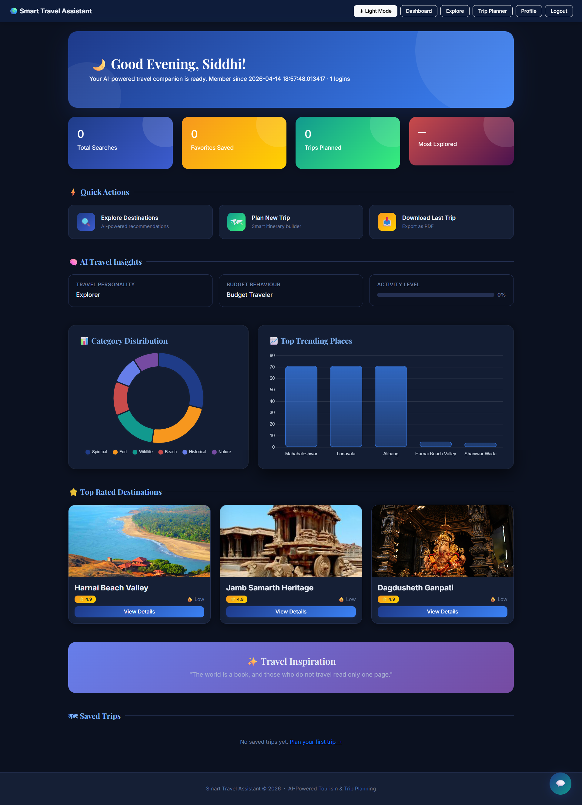
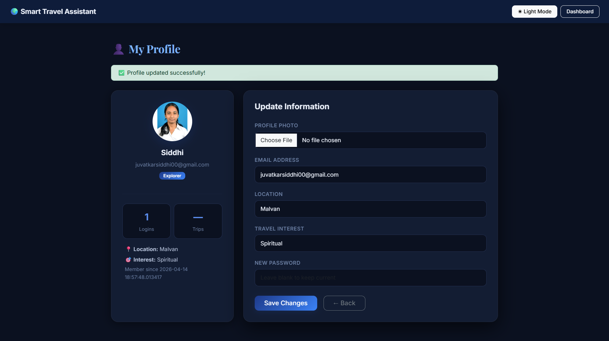
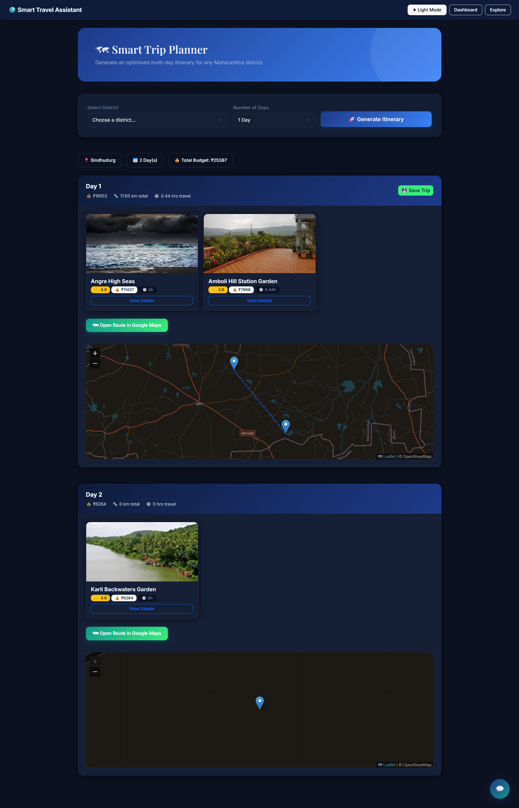
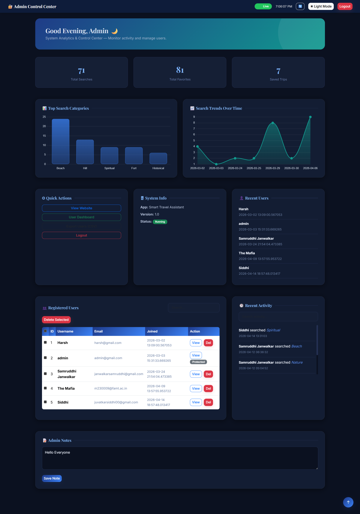

# 🌍 Tourist ML Project - Recommendation System

## 📌 Overview
This project is a Machine Learning-based tourist recommendation system that analyzes data and suggests suitable travel destinations based on user preferences and patterns.

The goal of this project is to enhance travel planning by providing intelligent and data-driven recommendations.

---

## 🚀 Features
- 🔍 Tourist destination recommendation
- 📊 Data analysis using Machine Learning
- 🧠 Smart suggestion system based on dataset
- 🌐 User-friendly interface
- 📈 Efficient data processing

---

## 🛠️ Technologies Used
- **Programming Language:** Python
- **Libraries:** Pandas, NumPy, Scikit-learn
- **Framework:** Flask
- **Frontend:** HTML, CSS
- **Database:** SQLite

---

## 📸 Screenshots

### 🔐 Login Page

### 📊 Dashboard

### 👤 Profile Page

### 🤖 Chatbot

### 🧭 Explore Destinations

### 🗺️ Trip Planner

### ⚙️ Admin Panel

---

## 📂 Project Structure

tourist-ml-project/
│
├── model/
├── routes/
├── static/
├── templates/
├── app.py
├── recommendation.py
├── models.py
├── metrics.py
└── users.db

---

## ⚙️ How to Run the Project

1. Clone the repository:

git clone https://github.com/Siddhi1845/tourist-ml-project.git

2. Navigate to project folder:

cd tourist-ml-project

3. Install dependencies:

pip install -r requirements.txt

4. Run the application:

python app.py

---

## 📊 Dataset
- Dataset used: **maharashtra_destinations.csv**
- Contains information about tourist places in Maharashtra
- Used for training and generating recommendations

---

## 🎯 Learning Outcomes
- Gained hands-on experience in Machine Learning
- Built a recommendation system
- Improved backend and data handling skills
- Worked on real-world project structure

---

## 🔗 GitHub Repository
👉 https://github.com/Siddhi1845/tourist-ml-project

---

## 👩‍💻 Author
**Siddhi Juvatkar**  
- LinkedIn: https://www.linkedin.com/in/siddhi-juvatkar-b24b27288  
- GitHub: https://github.com/Siddhi1845  

---

## ⭐ If you like this project
Give it a ⭐ on GitHub!
